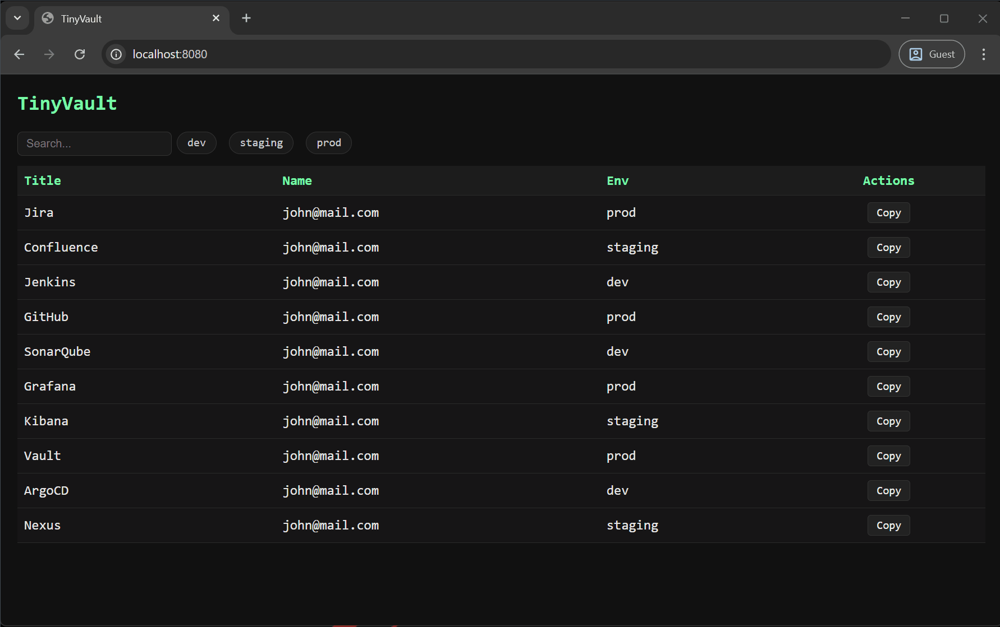

# TinyVault

A lightweight PowerShell password manager with AES-256 encryption and an optional local web interface.

## Why TinyVault

Built for restricted environments where installing third-party software is not allowed and the host clipboard is isolated from the guest. TinyVault requires only PowerShell 7 with no external dependencies, giving you a way to securely store and quickly copy passwords without leaving the environment.

## Features

- AES-256 encrypted vault with master password (PBKDF2 key derivation)
- Portable vault. Not tied to Windows identity, decryptable with the master password alone
- Optional local web server with a browser UI
- CSV import support
- Master password requested once per session

## Requirements

- PowerShell 7+ (pwsh)

## Installation

Available on [PowerShell Gallery](https://www.powershellgallery.com/packages/TinyVault).
```powershell
Install-Module TinyVault
```

## Commands

| Command | Description |
|---|---|
| `Add-TinyVaultEntry` | Add a new entry to the vault |
| `Edit-TinyVaultEntry` | Edit an existing entry |
| `Remove-TinyVaultEntry` | Remove an entry by ID |
| `Get-TinyVault` | List all entries |
| `Copy-TinyVaultEntry` | Copy a password to clipboard |
| `Import-TinyVaultCsv` | Import entries from a CSV file |
| `Set-TinyVaultMasterPassword` | Change the vault master password |
| `Install-TinyVaultWeb` | Download and install the web interface |

## Usage

```powershell
# Add an entry
Add-TinyVaultEntry -Title "Jira" -Name "john@mail.com" -Env "Prod"
# Insert Password: ****

# List entries
Get-TinyVault

# Copy a password to clipboard
Copy-TinyVaultEntry -Id 0

# Edit an entry
Edit-TinyVaultEntry -Id 0 -NewName "john@mail.com" -NewEnv "Staging"

# Remove an entry
Remove-TinyVaultEntry -Id 0

# Change master password
Set-TinyVaultMasterPassword

# Import from CSV
Import-TinyVaultCsv -CsvFile ".\credentials.csv"

# Download web server and html
Install-TinyVaultWeb
```

## CSV Format

```
title,name,env,password
Jira,john@mail.com,Prod,D0ntJudg3M3!
Confluence,john@mail.com,Staging,SuperP4ssw0rd123
Jenkins,john@mail.com,Dev,TryH@ckM3
```

## Web Interface

A local web server is available as a separate download. It provides a browser UI to view entries and copy passwords to clipboard. Passwords are never sent over the network. Copying is handled server-side via `Set-Clipboard`.



The web interface supports full keyboard navigation for a faster experience. No mouse required.
Press `↓` / `↑` to navigate entries, `Enter` to copy the selected password, `/` to search, `1` / `2` / `3` to filter by environment, and `Esc` to exit the search bar.

To download and install the web interface:
```powershell
Install-TinyVaultWeb
```

Files are saved to `$HOME\.tinyvault\web\`. Launch the server by running `Start-TinyVaultWeb.ps1` or `TinyVault.bat` from that folder.

## Vault

The vault is stored at `$HOME\.tinyvault\vault.json` as an AES-256 encrypted binary file. It is portable and can be moved across machines. Decryption requires only the master password.

## Security Notes

- The master password is never stored on disk
- Key derivation uses PBKDF2 with a random salt and 100,000 iterations
- The web server is local only and not intended to be exposed to a network
